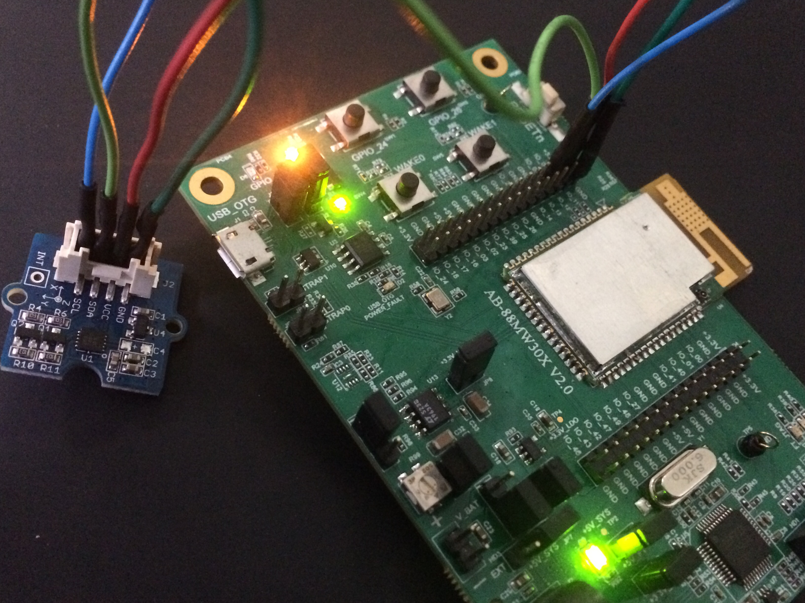
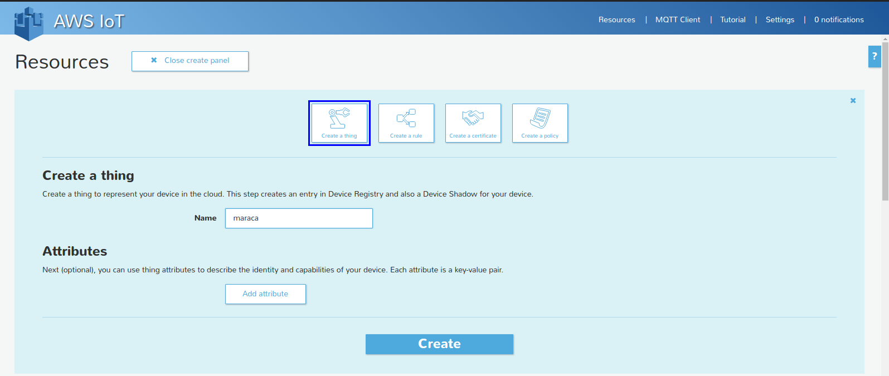
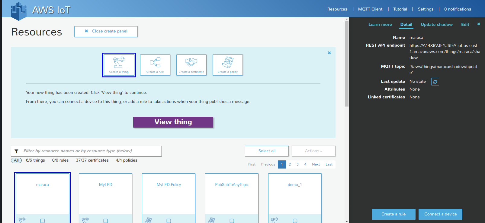
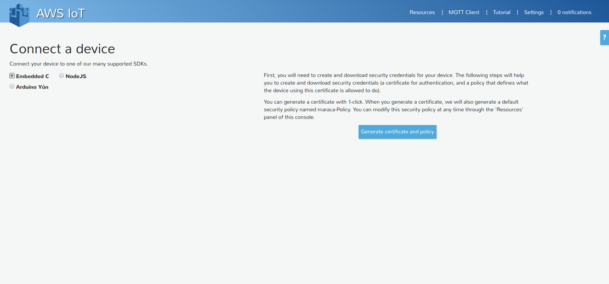
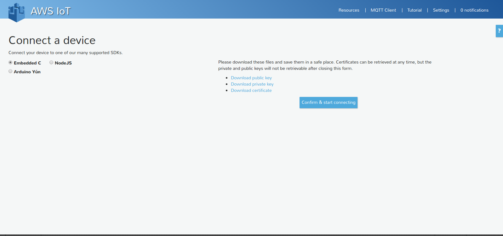

Connected Maraca
====

The following instructions will help you build a Internet connected Maraca using
the [Marvell IoT Starter Kit](http://www.amazon.com/Globalscale-MW302-IoT-Starter-Powered/dp/B0168DLQHI/ref=sr_1_1?ie=UTF8&qid=1459763298&sr=8-1&keywords=marvell+iot+starter+kit) with the [Groove 3-Axis Digital Accelerometer](http://www.seeedstudio.com/depot/twig-3axis-accelerometer-p-765.html?cPath=144_146)


## Step 1 - Wire hardware

The digital accelerometer that we will be using works over the I2C protocol. We are going to connect it to I2C0 bus on the Marvell IoT starter kit


The sensor has 4 pins -

| Sensor | IoT Starter Kit | Wire color
|:----|:----:|----:|
| GND | GND | Dark Green
| Vcc | +3.3V | Red
| SDA | IO_04 | Light Green
| SCL | IO_05 | Blue

Here's a picture of the connections :


## Step 2 - Get latest blob (includes wifi firmware and bootloader)
Flash the latest blob on the Marvell board.

- Download the latest blob from [releases](https://github.com/marvell-iot/aws_starter_sdk/releases) section of Marvell's SDK on GitHub
```
wget https://github.com/marvell-iot/aws_starter_sdk/releases/download/2015_12_08/aws_starter_sdk-2015_12_08.blob
```
- Use the `flash.py` script found in the GitHub SDK to upload the above blob to
your board
```
python sdk/tools/OpenOCD/flash.py -f aws_starter_sdk-2015_12_08.blob
```

## Step 3 - Compile Maraca sample code
Compile the Maraca application to create a binary called connected_maraca.bin
```
make APP=sample_apps/connected_maraca/
```

## Step 4 - Flash application binary to board
Flash the newly created binary to the board using the following command.
```
python sdk/tools/OpenOCD/flash.py --mcufw bin/mw302_rd/connected_maraca.bin
```
## Step 5 - Reset
Reset the board
```
python sdk/tools/OpenOCD/flash.py -r
```
You can also reset the board by pressing the reset button on the top left
of the board.

## Step 6 - Configure cloud
Generate keys on AWS IoT and download them

- Create a new thing


- View the thing and select Connect a device


- Pick Embedded C from the radio buttons


- Download the Private Key and certificate.


## Step 7 - Upload keys to board
Upload keys generated from your AWS IoT dashboard to the device by connecting to
the micro AP (Access Point) going to the address 192.168.10.1 using a web
browser.

## Step 8
Try it out !
Shake the Maraca and the changed state should be updated on AWS IoT.
