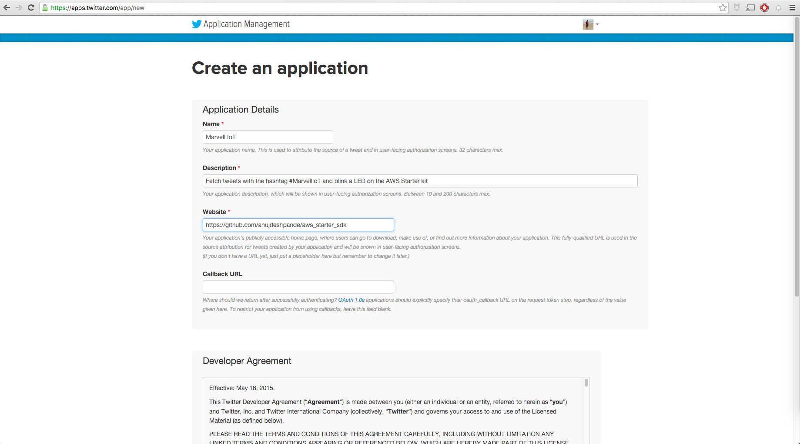
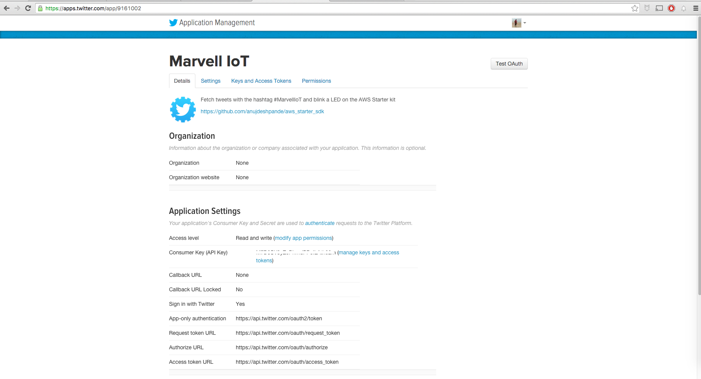
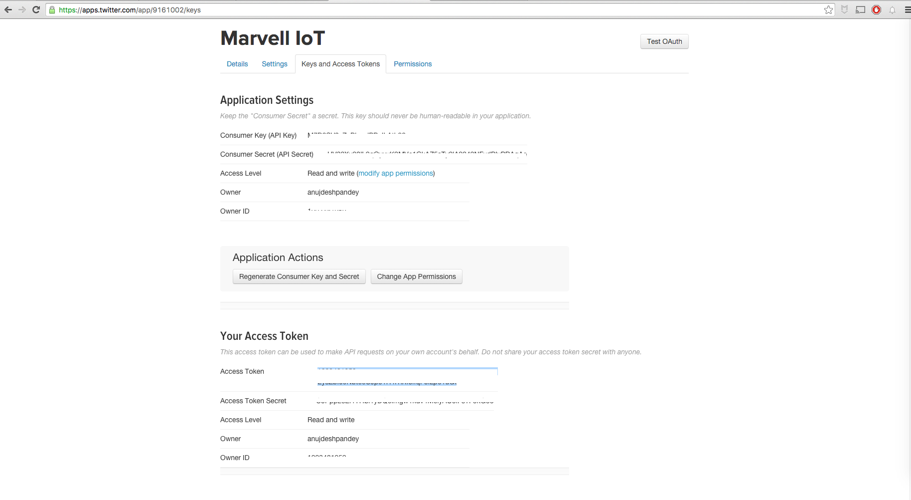

Twitter bot for LED blink using AWS Lambda
===

In this example, we are going to use AWS Lambda to track Twitter for a particular hashtag and blink the LED on our starter kit if anyone tweets using the said hashtag.

According to Amazon's [documentation](https://aws.amazon.com/documentation/lambda/)

> AWS Lambda is a zero-administration compute platform for back-end web developers that runs your code for you in the AWS cloud

### Step 1 : Create OAuth tokens and keys for Twitter
To access tweets from a python application, we are going to need a Twitter account with a registered phone number.
Once you have created an account, go to the following URL

    https://apps.twitter.com/app/new

Once there, enter details similar to the following :

After agreeing to the Terms and Conditions you will see a page similar to the following :

Select the `Keys and Access Tokens` tab from the top. Press `Generate Access Tokens` in case they haven't been generated already. Now you should have 4 keys with you : API Key, API Secret, Access Token, Access Secret.  

